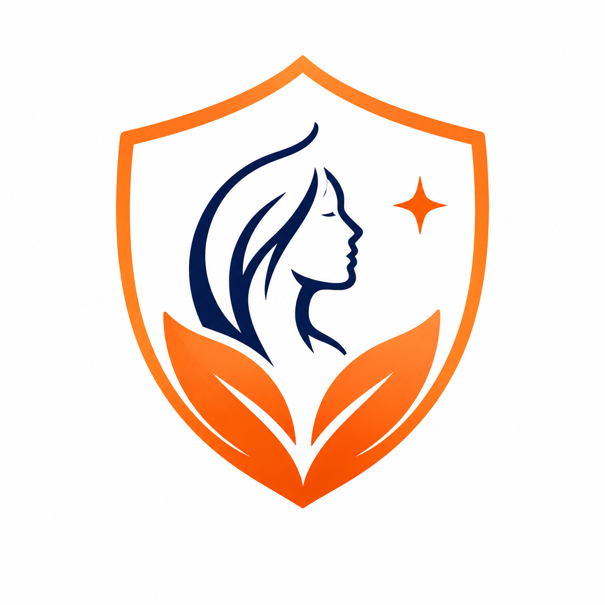

<div align="center">
# 🛡️ SakhiAI – Women's Safety Platform

### Empowering Women Through AI, Emergency Assistance & Digital Safety


 
<p align="center">
  
  
  
  
  
  
  
  
  
</p>
</div>

# 📖 Overview

**SakhiAI** is an AI-powered Women Safety Platform designed to provide legal assistance, emergency support, secure complaint filing, and NGO assistance through an intelligent web application and Telegram bot.

The platform combines Artificial Intelligence, Retrieval-Augmented Generation (RAG), verified legal documents, and emergency communication to help women receive timely guidance and support.

---

# ✨ Key Features

## 🤖 AI Sakhi

AI Sakhi is an intelligent legal assistant trained using Retrieval-Augmented Generation (RAG).

Features include:

* Legal guidance using verified Indian laws
* Workplace harassment assistance
* Domestic violence guidance
* Cyber crime support
* Dowry harassment information
* Stalking assistance
* Sexual harassment guidance
* Safety recommendations
* Evidence preservation advice
* Follow-up questions
* Source-based responses

---

## 📝 Complaint Management

Women can securely file complaints through the platform.

### Anonymous Complaint

* Identity remains hidden
* Secure complaint submission
* Upload supporting evidence
* Track complaint status

### Complaint with Identity

* Submit verified complaints
* Upload legal evidence
* Track complaint progress

Supported evidence:

* Images
* Videos
* Audio recordings
* Medical reports
* Screenshots
* Documents

---

## 📍 Complaint Tracking

Users can monitor complaint progress through a tracking portal using their complaint ID.

---

## 🤝 NGO Support

The platform connects users with Women Empowerment NGOs for:

* Legal support
* Counselling
* Shelter assistance
* Rehabilitation
* Women's welfare services

---

## 📱 Telegram Safety Bot

The Telegram bot acts as a personal safety companion.

Features:

* Emergency SOS trigger phrase
* Silent SOS activation
* Live location sharing
* Emergency contact notifications
* AI safety guidance
* Legal assistance
* User setup wizard

---

# 🧠 AI Sakhi Workflow

```text
                User
                  │
        ┌─────────┴─────────┐
        │                   │
     Website          Telegram Bot
        │                   │
        └─────────┬─────────┘
                  │
          FastAPI AI Backend
                  │
          LangChain RAG Engine
                  │
       Chroma Vector Database
                  │
      Legal PDF Knowledge Base
                  │
             Mistral AI Model
                  │
          AI Generated Response
```

---

# 🏗️ Project Structure

```text
Women-Safety/

├── backend/                        # Node.js + Express Backend
│
│   ├── server.js
│   │
│   ├── config/
│   │   └── db.js
│   │
│   ├── controllers/
│   │   ├── authController.js
│   │   ├── complaintController.js
│   │   └── emergencyController.js
│   │
│   ├── middleware/
│   │   ├── authMiddleware.js
│   │   ├── errorHandler.js
│   │   └── uploadMiddleware.js
│   │
│   ├── models/
│   │   ├── User.js
│   │   ├── Complaint.js
│   │   ├── Emergency.js
│   │   └── EmergencyContact.js
│   │
│   ├── routes/
│   │   ├── authRoutes.js
│   │   ├── complaintRoutes.js
│   │   └── emergencyRoutes.js
│   │
│   ├── services/
│   │   └── aiService.js
│   │
│   └── utils/
│       ├── ApiError.js
│       ├── asyncHandler.js
│       └── generateToken.js
│
├── my-app/                         # React + Vite Frontend
│
│   ├── public/
│   ├── src/
│   │   ├── assets/
│   │   ├── components/
│   │   ├── pages/
│   │   ├── App.jsx
│   │   └── main.jsx
│   │
│   └── package.json
│
├── Frontend/
│   └── chatbot/                    # FastAPI + Python AI Backend
│
│       ├── app.py
│       ├── requirements.txt
│       │
│       ├── utils/
│       │   ├── embedding.py
│       │   ├── loader.py
│       │   ├── prompts.py
│       │   ├── rag.py
│       │   └── splitter.py
│       │
│       ├── telegram_bot/
│       │   ├── bot.py
│       │   ├── orchestrator.py
│       │   ├── rag_connector.py
│       │   ├── setup_agent.py
│       │   └── sos_agent.py
│       │
│       ├── database/
│       │   ├── db.py
│       │   ├── models.py
│       │   ├── safeher.db
│       │   └── vectorstore/
│       │
│       └── data/
│           └── Legal Documents
```

---

# 🛠️ Technology Stack

| Category        | Technologies              |
| --------------- | ------------------------- |
| Frontend        | React, Vite, Tailwind CSS |
| Backend         | Node.js, Express.js       |
| AI Backend      | FastAPI, Python           |
| AI Framework    | LangChain                 |
| Vector Database | ChromaDB                  |
| LLM             | Mistral AI                |
| Database        | MongoDB, SQLite           |
| Bot             | Telegram Bot API          |
| Authentication  | JWT                       |
| File Uploads    | Multer                    |

---

## AI Technologies

- Retrieval Augmented Generation (RAG)
- Semantic Search
- Embedding Models
- Prompt Engineering

---

# 🚀 Running the Project

## 1. Backend

```bash
cd backend
npm install
npm start
```

Runs on:

```
http://localhost:5000
```

---

## 2. React Frontend

```bash
cd my-app
npm install
npm run dev
```

Runs on:

```
http://localhost:5173
```

---

## 3. AI Backend

```bash
cd Frontend/chatbot

pip install -r requirements.txt

uvicorn app:app --reload
```

Runs on:

```
http://localhost:8000
```

---

## 4. Telegram Bot

```bash
cd Frontend/chatbot

python -m telegram_bot.bot
```

# 🔑 Environment Variables

Create `.env`

```
MISTRAL_API_KEY=your_key

BOT_TOKEN=telegram_bot_token

MONGODB_URI=your_mongodb_uri
```
---


# 💬 AI Sakhi Response Flow

1. User submits a legal or safety question.
2. FastAPI receives the request.
3. LangChain retrieves relevant legal documents from ChromaDB.
4. Relevant legal context is injected into the prompt.
5. Mistral AI generates an answer using only retrieved legal information.
6. AI Sakhi responds with:

   * Immediate safety guidance
   * Legal rights
   * Relevant laws
   * Complaint filing recommendation
   * Evidence suggestions
   * Follow-up questions

---

# 🔒 Security Features

* Anonymous complaint filing
* Identity-based complaint submission
* Evidence upload support
* Complaint tracking
* Emergency SOS alerts
* Silent trigger phrase detection
* Live location sharing
* Secure document retrieval using RAG

---

# 📸 Platform Modules

* 🏠 Home Page
* 🤖 AI Sakhi Chatbot
* 📝 Anonymous Complaint Portal
* 👤 Identity Complaint Portal
* 📍 Complaint Tracking
* 🤝 NGO Directory
* 📱 Telegram Emergency Bot
* 🔐 User Authentication

---

# ❤️ Why AI Sakhi?

Many women hesitate to seek help because of fear, lack of legal knowledge, or concerns about privacy.

AI Sakhi aims to bridge this gap by providing:

- Immediate safety guidance
- Simple legal explanations
- Anonymous reporting
- Emergency assistance
- Trusted NGO connections
- AI-powered legal support available 24×7

---


# 👨‍💻 Developed By

**SakhiAI Team**

An AI-powered Women Safety Platform built using **React**, **Node.js**, **Express.js**, **FastAPI**, **LangChain**, **Mistral AI**, **ChromaDB**, **MongoDB**, and the **Telegram Bot API** to provide legal guidance, emergency assistance, and secure complaint management. 

Developed with ❤️ to create a safer digital environment for women.


<div align="center">

### 🌸 Empowering Women Through Technology

If you found this project useful, consider giving it a ⭐ on GitHub.

</div>
